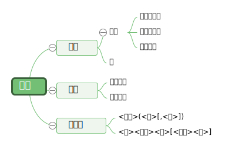
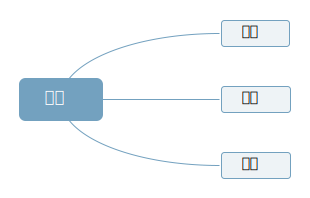

PROLOG 基础
=========================

定义和语法
-------------------------

对象
'''''''''''''''''''''''''

**对象** 包括三种: **变量**, **常量**, **复合项**.

如图所示:

其中:

- **标识符原子**: 由小写字母开头, 包含小写字母或数字. 例如: ``znote``, ``cj521``.
- **字符串原子**: 由引号括起来的字符串.
- **特殊原子**: 特殊符号, 例如 ``+``, ``-``, ``*`` 等.

- **普通变量**: 表示暂时无法命名或无需命名的对象, **大写字母开头**.
- **特殊变量**: **空变量**, 表示对该变量的值不关心.

- **复合项**: 由一组其他对象组成的单个对象. 例如:

    函数项::
        
        like(john, apple)
    表::

        [sa, sb], [1, 2, 3]
    表达式::

        (12 + 59) * 49 - 46

语句
''''''''''''''''''''''''

PROLOG 中的语句也分为三种形式.

- **事实**: 

    语法: :math:`P.`

    含义: 无条件成立, 恒为真.
    例如::

        like(monkey, banana)

- **规则**:

    语法: :math:`P\ :-\ P_1, P_2, P3, ..., P_n.`

    含义: 若 :math:`P_1, P_2, P3, ..., P_n` 全为真, :math:`P` 为真.

    .. note:: ``:-`` 表示"蕴涵", ``,`` 表示"合取".

- **问题**:

    语法::

        Goal

        Q1, Q2, ... , Qm.

    含义: 待回答问题, 即 :math:`Q1, Q2, ... , Q_m` 是否同时为真.

从消解的角度来看:

1. **事实** 中, :math:`P` 是 ``Horn`` 字句.
2. **规则** 可以表示为:

.. math:: P_1 \wedge P_2 \wedge ... \wedge P_n \Rightarrow P

可以转化为:

.. math:: ~P_1 \vee ~P_2 \vee ... \vee ~P_n \vee P

也是 ``Horn`` 子句, 并受 **全称量词** 约束.

3. **问题** 可以表示为:

.. math:: Q_1 \wedge Q_2 \wedge ... \wedge Q_m

受 **存在量词** 约束, 取非后

.. math:: ~Q_1 \vee ~Q_2 \vee ... \vee ~Q_n

受 **全称量词** 约束.

.. note::

    ProLog 三种形式的语句都是 ``Horn`` 子句, 问题的求解就是 ``Horn`` 子句的 **消解**.

表结构
'''''''''''''''''''''''''

**表** : 若干个元素的有序序列.

**表中的元素** : 常量, 变量, 对象, 表

表使用 ``[ ]`` 来表示, 元素之间使用 **逗号**, 或者 **空格** 分开.

例如::

    [1,2,3]
    [a b c d]

符号 ``|`` 用来划分表中的元素. 

例如::

    P ([1, 2, 3, 4]).

    ?- P([X|Y]).
    % 答案: X = 1, Y = [2,3,4]

    ?- P([X,Y|Z]).
    % 答案: X = 1, Y = 2, Z = [3,4]

.. attention:: 若表中只有一个元素, 分割后第二个为空. 空表都为空.

程序结构
-----------------------------------

Prolog 的程序分为两部分:

- 前提部分: 所有的事实和规则.

- 问题部分: 目标子句的序列.

.. attention:: 这两部分不能颠倒, 必须 **前提部分** 在前, **问题部分** 在后.

例如::

    % 事实
    likes(he, eat).
    likes(he, study).
    likes(she, study).
    likes(she, apple).

    goal
    % 问题
    % he 和 she 都喜欢什么东西
    likes(he, X), likes(she, X).

ProLog 的求解过程:

    现在有两个问题 ``likes(he, X)`` 和 ``likes(she, X)``.

    1. 使用第一个问题与事实匹配 (置换与合一), 按 **顺序** 得到 ``{eat/X}``.
    2. f 代替第二个问题 ``likes(she, X)`` 中的 ``X``, 获得 ``likes(she, eat)``,再与事实匹配, 不能匹配失败, 回溯, 忘记刚才的匹配.
    3. 回到第一个问题 ``likes(he, X)``, 重新匹配得到 ``{study/X}``.
    4. 第二个问题变为 ``likes(she, study)``, 再与事实匹配, 成功.
    5. 答案为 ``X = study``.

    .. attention:: 
    
        实际运行中, 要逐个搜索, 成功也要回溯以求出所有解. 如果是有规则的问题, 则逐一匹配并转为为规则的子问题.

Prolog 的实现方法主要是 : 匹配与回溯.

- **匹配** : 合一, 消解.
- **回溯** : 搜索, 深度优先.

常用内部谓词
-----------------------------

算术运算
'''''''''''''''''''''''''''

算术运算由操作数, 操作符与括号组成. 优先级与通常数学一致.

比较谓词
'''''''''''''''''''''''''

1. eq(X, Y) :   X = Y

2. ne(X, Y) :   X <> Y

3. gt(X, Y) :   X > Y

4. ls(X, Y) :   X < Y

.. note:: 对于 ``eq`` 和 ``ne``, X 和 Y 可以是常量, 变量, 谓词 或者 表.

输入输出谓词
''''''''''''''''''''''''''

1. write(X): 向输出设备输出实例化结果
2. read(X): X 未实例化时, 输入一个项. X 已实例化时, 将输入与 X 匹配, 获得真假值.

特殊谓词
''''''''''''''''''''''''

cut(!) : 禁止回溯

    1. cut 只允许作为子目标出现在程序中.
    2. 第一次遇到时会立刻执行, 但无法重新执行.
    3. 用户可以使用它来控制回溯方式, 提高程序效率.

fail: 强迫回溯

    作为一个子目标, 使程序运行到 ``fail``, 必定引起回溯.

例子(求 1 到 n 的和)::

    sum(1,1) :- !.
    sum(N,R) :- N1 is N-1, sum(N1,R1), R is R1 + N.

    ?- sum(6, X).
    % out X = 21.

.. attention:: ``=`` 是比较, ``is`` 才是赋值.

Prolog 程序设计步骤
--------------------------------

1. 说明事实
    
说明关系, 叙述事实.

2. 定义规则

定义个体及推理规则.

3. 确定目标(问题)

提出待解决问题或着确定逻辑推理的目标.